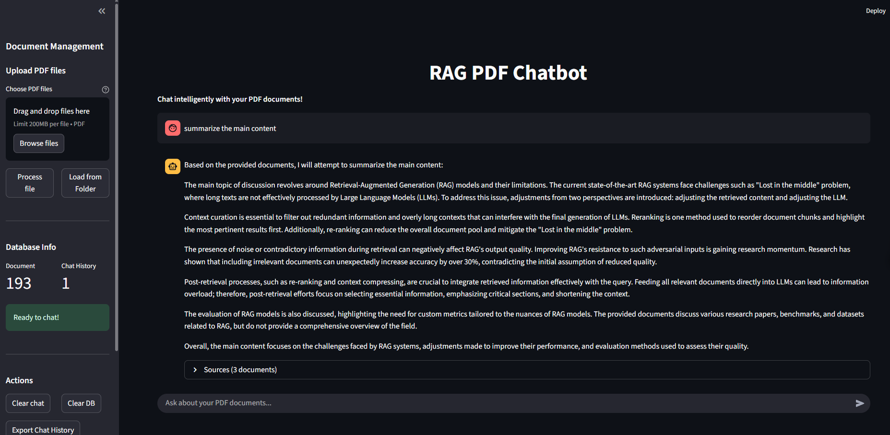

# RAG Chatbot

A Retrieval-Augmented Generation (RAG) PDF chatbot. This application allows users to upload PDF and ask questions about their content using advanced AI capabilities.

## Prerequisites

- Python 3.8 or higher
- Ollama installed on your system
- At least 8GB RAM 

## Installation

### 1. Clone the Repository

```bash
git clone https://github.com/trungit03/Chatbot-RAG.git
```

### 2. Install Ollama

**For macOS:**
```bash
curl -fsSL https://ollama.ai/install.sh | sh
```

**For Windows:**
Download and install from [ollama.ai](https://ollama.ai/download)

**For Linux:**
```bash
curl -fsSL https://ollama.ai/install.sh | sh
```

### 3. Pull the Llama 3.1 8B Model

```bash
ollama pull llama3.1:8b
```

### 4. Set Up Python Environment

Create a virtual environment:
```bash
python -m venv .venv
```

Activate the virtual environment:
- **Windows:** `.venv\Scripts\activate`
- **macOS/Linux:** `source .venv/bin/activate`

### 5. Install Dependencies

```bash
pip install -r requirements.txt
```

## Configuration

The application uses a configuration file `config.py` for settings.

## Usage

### 1. Start Ollama Service

Make sure Ollama is running:
```bash
ollama serve
```

### 2. Run the Application

```bash
python3 main.py --web
```

### 3. Demo


